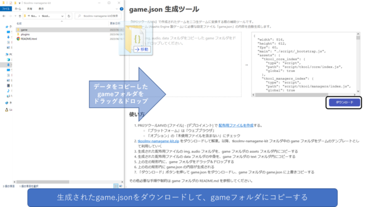

<p align="center">

</p>

# tkoolmv-namagame-gamejson-helper

『RPGツクールMV』で作成されたゲームをニコ生ゲームに変換する際の補助ツールです。  
ニコ生ゲーム (Akashic Engine 製ゲーム) に必要な設定ファイル「game.json」の内容を自動生成します。  
**[Akashic Web サイトで公開されている](https://akashic-games.github.io/shin-ichiba/tkool-mv/gamejson-helper/)ので、通常ゲーム開発者がこれを利用する必要はありません。**



ここで生成された game.json をダウンロードボタンでダウンロードできます。

## ビルド

```sh
npm install
npm run build
```

### ビルド成果物の内容
`dist/` ディレクトリに以下のようなファイルが出力されます。

- index.html: game.json生成ページ。公式ページで https://akashic-games.github.io/shin-ichiba/tkool-mv/gamejson-helper/ というURLで利用される
- index.*.js: game.json生成ページで利用されるスクリプト

## 使用方法

`dist/index.html` を Web サーバでホストし、ブラウザで開いてください。`file://` では動作しません。
詳細は[ニコ生ゲームへの変換手順](https://akashic-games.github.io/shin-ichiba/tkool-mv/exchange-to-nicolive-game-manually.html)を参照してください。

## ライセンス
本リポジトリは MIT License の元で公開されています。
詳しくは [LICENSE](https://github.com/akashic-games/tkoolmv-namagame-gamejson-helper/blob/main/LICENSE) をご覧ください。

ただし、画像ファイルおよび音声ファイルは
[CC BY 2.1 JP](https://creativecommons.org/licenses/by/2.1/jp/) の元で公開されています。
